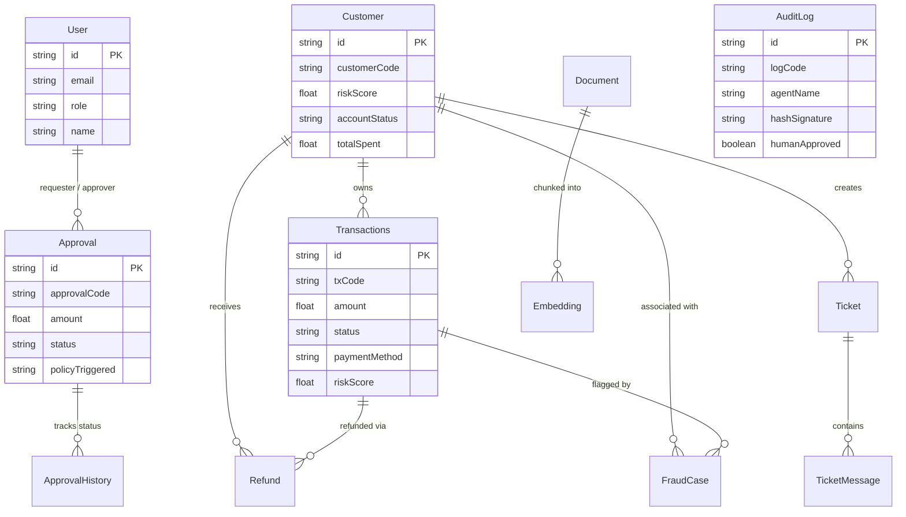

# Entity-Relationship (ER) Diagram

```mermaid
erDiagram
    User ||--o{ Approval : "requester / approver"
    Customer ||--o{ Transactions : "owns"
    Customer ||--o{ Ticket : "creates"
    Customer ||--o{ Refund : "receives"
    Customer ||--o{ FraudCase : "associated with"
    Transactions ||--o{ Refund : "refunded via"
    Transactions ||--o{ FraudCase : "flagged by"
    Ticket ||--o{ TicketMessage : "contains"
    Approval ||--o{ ApprovalHistory : "tracks status"
    Document ||--o{ Embedding : "chunked into"

    User {
        string id PK
        string email
        string role
        string name
    }

    Customer {
        string id PK
        string customerCode
        float riskScore
        string accountStatus
        float totalSpent
    }

    Transactions {
        string id PK
        string txCode
        float amount
        string status
        string paymentMethod
        float riskScore
    }

    Approval {
        string id PK
        string approvalCode
        float amount
        string status
        string policyTriggered
    }

    AuditLog {
        string id PK
        string logCode
        string agentName
        string hashSignature
        boolean humanApproved
    }
```
