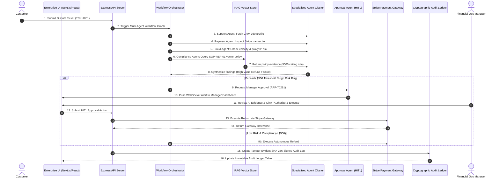

# Sequence Diagram - Multi-Agent Workflow Execution

```mermaid
sequenceDiagram
    autonumber
    actor Customer
    participant Frontend as Enterprise UI (Next.js/React)
    participant API as Express API Server
    participant Orchestrator as Workflow Orchestrator
    participant RAG as RAG Vector Store
    participant Agents as Specialized Agent Cluster
    participant HITL as Approval Agent (HITL)
    participant Gateway as Stripe Payment Gateway
    participant Audit as Cryptographic Audit Ledger
    actor Manager as Financial Ops Manager

    Customer->>API: 1. Submit Dispute Ticket (TCK-1001)
    API->>Orchestrator: 2. Trigger Multi-Agent Workflow Graph
    Orchestrator->>Agents: 3. Support Agent: Fetch CRM 360 profile
    Orchestrator->>Agents: 4. Payment Agent: Inspect Stripe transaction
    Orchestrator->>Agents: 5. Fraud Agent: Check velocity & proxy IP risk
    Orchestrator->>RAG: 6. Compliance Agent: Query SOP-REF-01 vector policy
    RAG-->>Agents: 7. Return policy evidence ($500 ceiling rule)
    Agents-->>Orchestrator: 8. Synthesize findings (High Value Refund > $500)
    
    alt Exceeds $500 Threshold / High Risk Flag
        Orchestrator->>HITL: 9. Request Manager Approval (APP-70291)
        HITL->>Frontend: 10. Push WebSocket Alert to Manager Dashboard
        Manager->>Frontend: 11. Review AI Evidence & Click "Authorize & Execute"
        Frontend->>API: 12. Submit HITL Approval Action
        API->>Gateway: 13. Execute Refund via Stripe Gateway
        Gateway-->>API: 14. Return Gateway Reference
    else Low Risk & Compliant (< $500)
        Orchestrator->>Gateway: 9b. Execute Autonomous Refund
    end

    API->>Audit: 15. Create Tamper-Evident SHA-256 Signed Audit Log
    Audit-->>Frontend: 16. Update Immutable Audit Ledger Table
```
